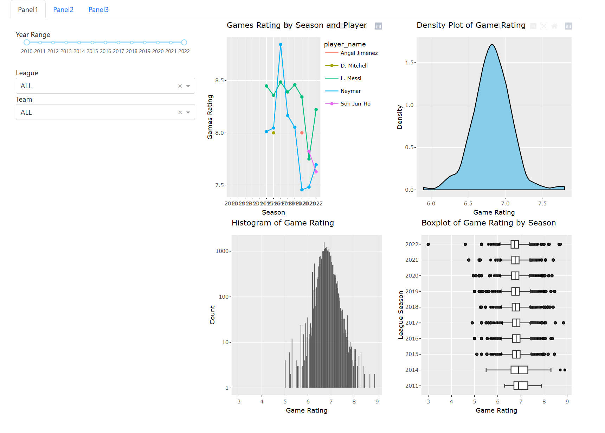

# FootballScout 
# https://footballscout-app.herokuapp.com/

## Description & sketch

This dashboard contains 3 panels. Panel 1 is used to view overall information, panel 2 is used to compare selected data for selected players, and panel 3 is used to predict a player's performance for the following year.

### Panel 1

panel1 is used to view the overall information, which includes three charts, the first chart draws the top 5 rating players for the selected year, league, and team, the second chart uses a histogram to draw the rating distribution of all players in the selected year, league, and team, and the third panel uses a boxplot to draw the rating distribution of all players in the selected year, league, and team.

### Panel 2

Panel 2 as shown is used to compare selected data for selected players. if time allows we will extend to this panel to allow unlimited selection of players and stats.

### Panel 3

panel 3 as shown is used to predict a player's performance for the following year. A model is fitted based on the past game ratings of the selected player, which allows a prediction of game rating for the next year.

